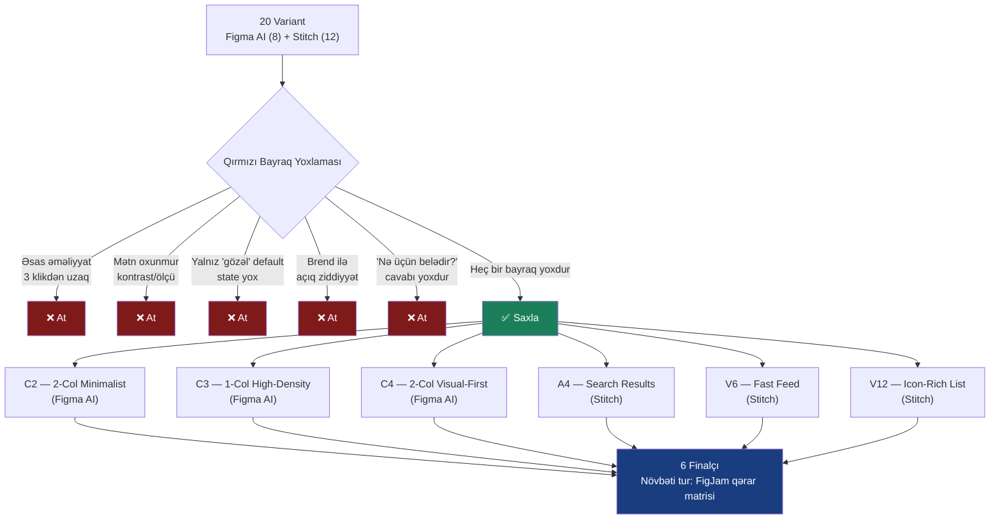

# Marketplace — Category Listing: Dizayn Qiymətləndirmə Prosesi

20 variant (Figma AI + Stitch) → 4 qırmızı bayraq meyarı ilə süzülərək 6 finalçıya endirildi.

## Qiymətləndirmə Sxemi

---

## Bayraq Meyarları (evaluation-framework.md, bölmə 03)

| # | Bayraq | Təsvir |
|---|---|---|
| 1 | Əsas əməliyyat 3 klikdən uzaqdır | Kartda birbaşa CTA yoxdur → list→detail→əməliyyat |
| 2 | Mətn oxunmur | Kontrast və ya ölçü problemi |
| 3 | Yalnız "gözəl" default var | State (out of stock, sale, used) əhatə olunmayıb |
| 4 | Brend ilə açıq ziddiyyət | Kateqoriya/adlandırma məntiqi pozulub |
| 5 | "Nə üçün belədir?" cavabı yoxdur | Dizayn qərarı əsaslandırılmayıb |

---

## Atılan Variantlar (14)

### Figma AI

| Variant | Bayraq | Niyə |
|---|---|---|
| B1 — 1-Col Price Focus | 3 klikdən uzaq | Kartda CTA yox |
| B2 — 1-Col Rating Focus | Brend ziddiyyəti | Kart-kart fərqli CTA — sistemsiz |
| B3 — 2-Col Standard Grid | Tamamlanmayıb | State coverage yoxdur |
| B4 — 2-Col Offset Grid | Əsaslandırılmayıb | Offset/masonry izahsız |
| C1 — 1-Col Elevated Cards | 3 klikdən uzaq | Kartda CTA yox |

### Stitch

| Variant | Bayraq | Niyə |
|---|---|---|
| A1 — 42 Results | 3 klikdən uzaq | Heart var, buy yox |
| A2 — Hot badge grid | 3 klikdən uzaq | CTA yox |
| A3 — Like New phone | Mətn oxunmur | Overlay üstündə price kontrastı zəif |
| A5/V5 — Premium Dark | Tamamlanmayıb | Yalnız 2 kart, digər state yox |
| V7 — Niu scooter | Brend ziddiyyəti | Detail page, "Category Listing" adı ilə ziddiyyət |
| V8 — Trending Spots | Tamamlanmayıb | Badge/state sistemi yoxdur |
| V9 — Artisanal Sourdough | Əsaslandırılmayıb | Hər kartda fərqli promo format |
| V10 — £45 desk lamp | Tamamlanmayıb | Strikethrough qiymətdən başqa state yox |
| V11 — Explore Deals | Əsaslandırılmayıb | Hero+grid qarışığı izahsız |

---

## Final 6

| Variant | Mənbə | Güclü tərəf |
|---|---|---|
| **C2** — 2-Col Minimalist | Figma AI | LTD Edition state, aydın hierarxiya |
| **C3** — 1-Col High-Density | Figma AI | Top Seller/Refurbished/Financing/Sale + filter/search |
| **C4** — 2-Col Visual-First | Figma AI | Top Rated/New/Sale + FAB Filter&Sort |
| **A4** — Search Results | Stitch | Out of Stock + Notify, tam CTA sistemi |
| **V6** — Fast Feed | Stitch | Hot/New/Out of stock, sistemli CTA |
| **V12** — Icon-Rich List | Stitch | Filter chip, Used/New, Price Drop, distance, FAB |

**Nəticə:** hər iki alət 3-3 nisbətlə təmsil olunur — bu, alət seçiminin deyil, prompt/işləmə metodunun nəticəyə təsir etdiyini göstərir.

**Növbəti addım:** bu 6-nı FigJam-da qərar matrisinə qoyub 2-cü tur elimination.
